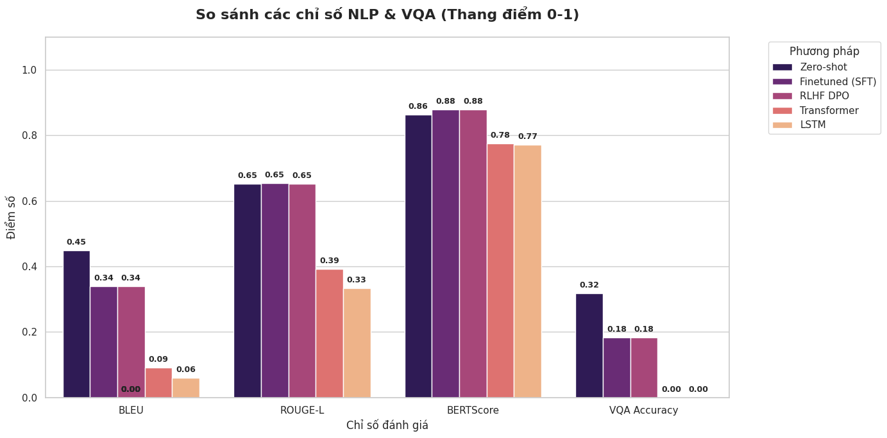
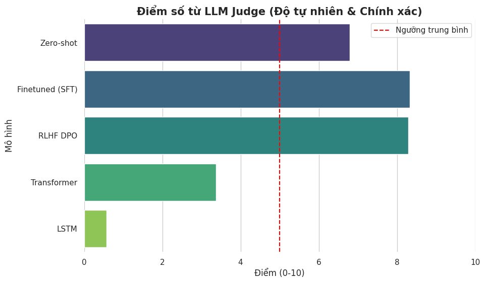

# Vietnamese Visual Question Answering (VQA) for Specific Domain

Dự án xây dựng hệ thống Hỏi đáp trên Ảnh (VQA) dành riêng cho tiếng Việt, tập trung vào một miền dữ liệu chuyên biệt. Hệ thống kết hợp sức mạnh của thị giác máy tính (Computer Vision) và xử lý ngôn ngữ tự nhiên (NLP) để trả lời các câu hỏi liên quan đến nội dung hình ảnh.

## 📌 Giới thiệu dự án
Hệ thống nhận đầu vào là **Hình ảnh** và **Câu hỏi tiếng Việt**, sau đó sinh ra **Câu trả lời** tương ứng. Dự án thực hiện so sánh đối chứng giữa các kiến trúc rời rạc (Modular) và các mô hình đa phương thức tiền huấn luyện (Multimodal Pretrained), đồng thời áp dụng các kỹ thuật học tăng cường (RLHF/DPO) để tối ưu hóa câu trả lời.

### Các đặc điểm chính:
- **Dữ liệu:** > 3600 (> 11000) bộ câu hỏi (ảnh, câu hỏi, câu trả lời) với miền dữ liệu chuyên biệt.
- **Kiến trúc:** So sánh giữa LSTM Decoder, Transformer Decoder và Fine-tune mô hình lớn (BLIP/LLaVA).
- **Học tăng cường:** Sử dụng phương pháp DPO (Direct Preference Optimization) để cải thiện chất lượng phản hồi.
- **Đánh giá đa chiều:** Kết hợp các chỉ số truyền thống (BLEU, ROUGE) và hiện đại (BERTScore, LLM-as-a-judge).

---

## 🚀 Hướng dẫn cài đặt và Sử dụng

### 1. Cài đặt môi trường
Đảm bảo bạn đã cài đặt Python. Cài đặt các thư viện cần thiết bằng lệnh:

```bash
pip install -r requirements.txt
```

> **⚠️ Lưu ý về phiên bản PyTorch:** 
> Nếu bạn sử dụng GPU NVIDIA, hãy cài đặt phiên bản PyTorch hỗ trợ CUDA để đạt hiệu suất tốt nhất. Ví dụ với CUDA 11.8:
> `pip install torch torchvision --index-url https://download.pytorch.org/whl/cu118`

### 2. Chạy Demo (Gradio App)
Dự án cung cấp giao diện trực quan để thử nghiệm mô hình:

```bash
python gradio_app.py
```
Sau khi chạy, truy cập đường dẫn `http://127.0.0.1:7860` trên trình duyệt.

---

## 🏗️ Kiến trúc Mô hình

Dự án thực hiện thử nghiệm trên 4 cấu hình chính:
1. **A1 (LSTM Decoder):** Image Encoder (ResNet) + Text Encoder (PhoBERT) + LSTM Decoder.
2. **A2 (Transformer Decoder):** Giống A1 nhưng thay LSTM bằng Transformer Decoder.
3. **B1 (Zero-shot):** Sử dụng các mô hình Multimodal lớn (như BLIP/LLaVA) chạy trực tiếp không qua huấn luyện lại.
4. **B2 (Fine-tuned):** Fine-tune mô hình Multimodal trên tập dữ liệu tiếng Việt chuyên biệt bằng SFT và DPO.

---

## 📊 Kết quả thực nghiệm

### Bảng so sánh tổng thể các chỉ số:

| STT | Mô hình | BLEU | ROUGE-L | BERTScore | VQA Accuracy | LLM Judge |
|:---:|:---|:---:|:---:|:---:|:---:|:---:|
| 0 | **Zero-shot** | 0.4495 | 0.6522 | 0.8639 | **0.3176** | 6.7977 |
| 1 | **Finetuned (SFT)** | 0.3402 | **0.6532** | **0.8794** | 0.1833 | **8.3273** |
| 2 | **RLHF DPO** | 0.3399 | 0.6521 | 0.8790 | 0.1833 | 8.2856 |
| 3 | **Transformer** | 0.0919 | 0.3914 | 0.7758 | 0.0000 | 3.3704 |
| 4 | **LSTM** | 0.0601 | 0.3336 | 0.7721 | 0.0000 | 0.5782 |

### Biểu đồ trực quan:

#### 1. So sánh các chỉ số NLP & VQA (Thang điểm 0-1)
Biểu đồ này cho thấy sự vượt trội của các phương pháp tiền huấn luyện (Zero-shot, SFT) so với kiến trúc rời (Transformer/LSTM) trên các thang đo truyền thống.


#### 2. Điểm số từ LLM Judge (Độ tự nhiên & Chính xác)
Đánh giá từ mô hình ngôn ngữ lớn (LLM) cho thấy các phiên bản Finetuned (SFT/DPO) có độ tự nhiên và khả năng trả lời sát với thực tế nhất, vượt xa ngưỡng trung bình.

---

## 🔍 Phân tích & Đánh giá
- **Kiến trúc rời (A1, A2):** Gặp khó khăn trong việc hội tụ với dữ liệu ít (3600 mẫu), dẫn đến VQA Accuracy thấp. Transformer Decoder có xu hướng nhỉnh hơn LSTM một chút về khả năng nắm bắt ngữ cảnh.
- **Multimodal (B1, B2):** Đạt kết quả rất ấn tượng. Đặc biệt, việc **Fine-tuning (SFT)** giúp tăng mạnh điểm số **LLM Judge (từ 6.7 lên 8.3)**, giúp câu trả lời trở nên tự nhiên và đúng trọng tâm tiếng Việt hơn.
- **RLHF/DPO:** Giúp duy trì hiệu suất ổn định và tinh chỉnh phong cách trả lời theo ý muốn của người dùng.

---
*Dự án được thực hiện như một phần của bài tập nghiên cứu hệ thống VQA đa phương thức.*
